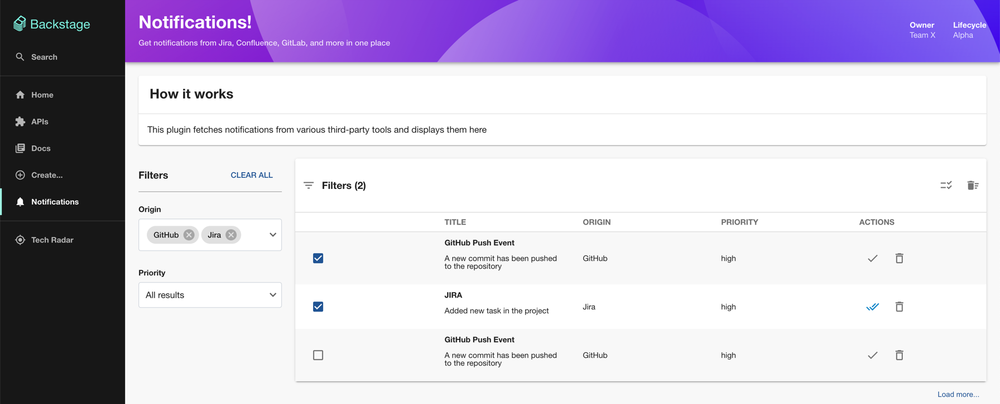
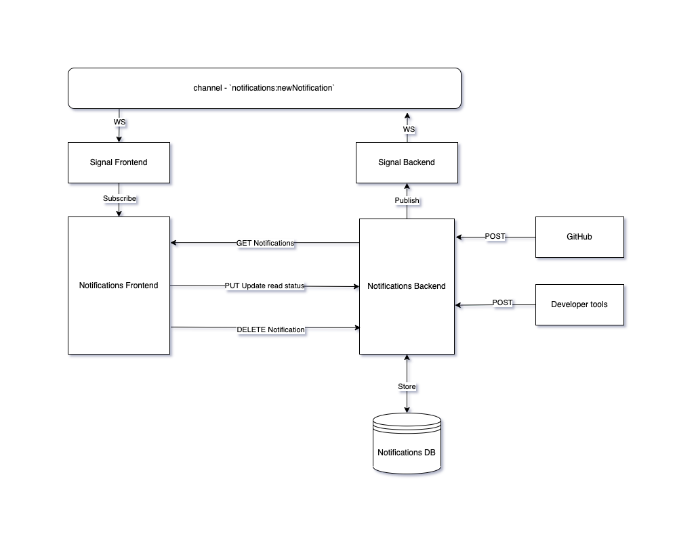

# Notifications Plugin for Backstage

Welcome to the notifications plugin!

## Overview

The Notifications Plugin is designed to aggregate notifications from multiple third-party tools like Jira, Confluence,
GitLab,
and custom-developed tools. It aims to provide a unified notifications interface within Backstage.

### Features

- **Frontend Plugin**: Displays notifications in a dedicated page within Backstage.
- **Backend Plugin**: Stores notifications in a database, fetches new notifications via REST API endpoints and WebSockets.
- **Common Plugin**: Contains shared types and utilities used by both the backend and frontend plugins.



## Architecture

When a user accesses the notifications page, the frontend plugin retrieves notifications from the backend plugin through
a GET API request. In order to provide real-time notifications, the frontend plugin establishes a connection with the
backend plugin using WebSockets.

This connection persists as long as the user remains active within the Backstage application, enabling the backend to
deliver notifications as they arrive from various third-party tools. We utilize the Backstage Signals plugin to manage
this WebSockets connection. It's important to note that both the frontend and backend must subscribe to the same channel
in order to facilitate the receipt of real-time notifications.



## Getting started

Switch to the root directory of the project and
run the following command to start the app:

```sh
nvm use
yarn install
yarn dev
```

These commands will install the dependencies and start the Backstage whole app. App will start
in http://localhost:3000/notifications

## Testing

An interactive mock server has been added to test the Notifications plugin.

```sh
nvm use
yarn run:mock-server
```
